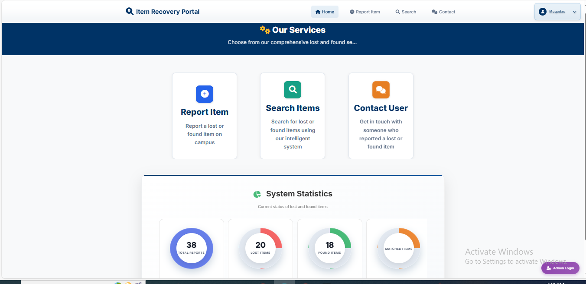
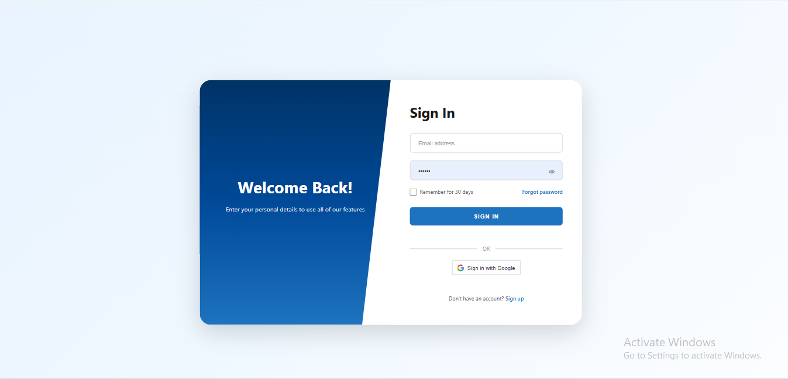
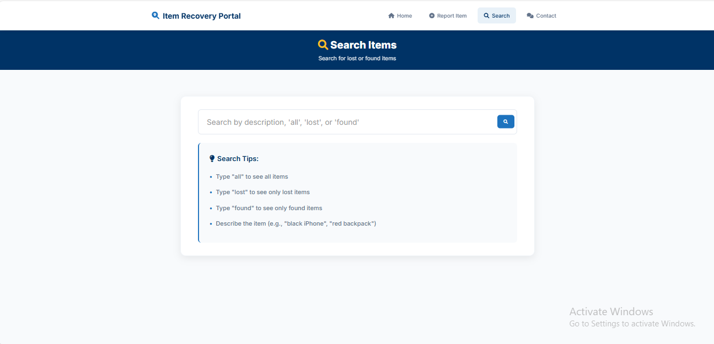
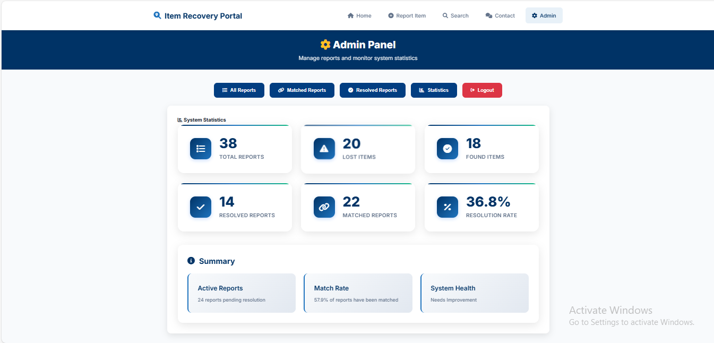
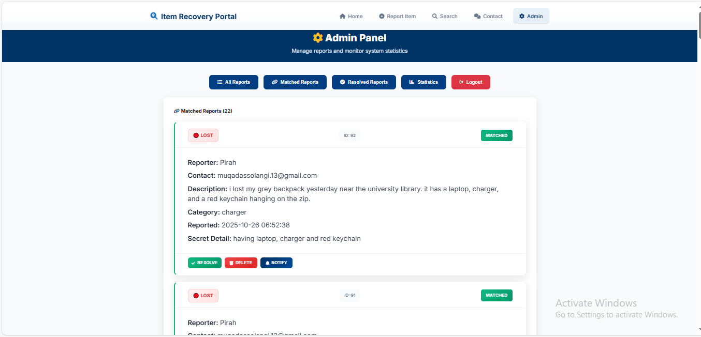
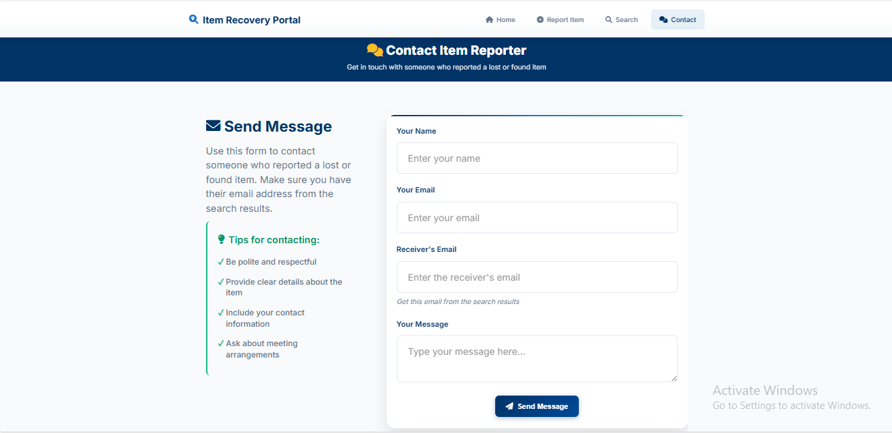
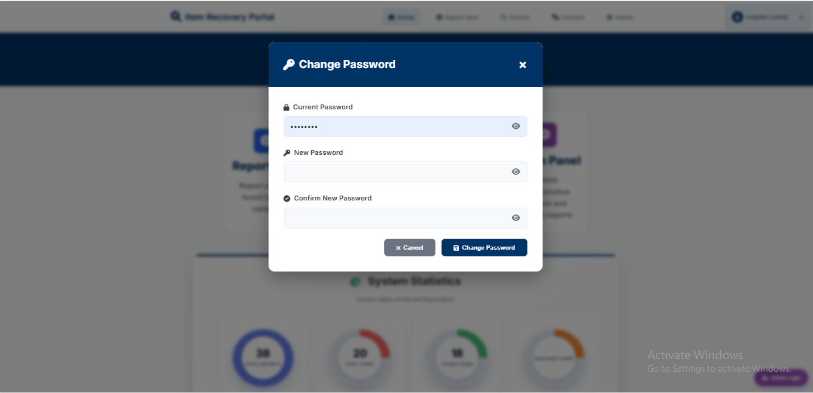

# 🎯 AI-Powered Lost & Found Management System

<div align="center">


**A modern web application for managing lost and found items with AI-powered semantic matching capabilities**

[Features](#-features) • [Installation](#-installation) • [Screenshots](#-screenshots) • [Usage](#-usage) • [Tech Stack](#-tech-stack)

</div>

---

## 📋 Table of Contents

- [Overview](#-overview)
- [Features](#-features)
- [Screenshots](#-screenshots)
- [Technology Stack](#-tech-stack)
- [Installation](#-installation)
- [Configuration](#-configuration)
- [Usage](#-usage)
- [API Endpoints](#-api-endpoints)
- [AI Features](#-ai-features)
- [Project Structure](#-project-structure)
- [Troubleshooting](#-troubleshooting)

---

## 🎯 Overview

This is a comprehensive **Lost and Found Management System** that uses **Artificial Intelligence** and **Natural Language Processing (NLP)** to automatically match lost and found items. Unlike traditional systems that require exact keyword matching, this platform uses semantic understanding to connect items even when descriptions use different words but convey the same meaning.

### Key Highlights

✨ **Intelligent Matching** - AI-powered semantic matching using sentence transformers  
📧 **Auto Notifications** - Instant email alerts when matches are found  
🔐 **Secure Authentication** - User login/signup with Google OAuth support  
👨‍💼 **Admin Dashboard** - Complete administrative interface  
📱 **Responsive Design** - Works seamlessly on all devices  
🔍 **Smart Search** - Real-time semantic search capabilities  

---

## ✨ Features

### Core Features

- 🤖 **AI-Powered Semantic Matching**
  - Uses NLP and sentence transformers for intelligent item matching
  - Matches items even when descriptions use different words
  - Automatic category detection and classification

- 📸 **Image Support**
  - Upload and view images of lost/found items
  - Image-based item identification

- 📧 **Email Notifications**
  - Automatic email alerts when matches are found
  - Detailed match information with contact details
  - HTML-formatted email templates

- 🔐 **User Authentication**
  - Secure user registration and login
  - Email verification system
  - Google OAuth integration
  - Password reset functionality

- 👨‍💼 **Admin Panel**
  - Complete administrative dashboard
  - View, manage, and resolve reports
  - System statistics and analytics
  - User management capabilities

- 🔍 **Advanced Search**
  - Real-time semantic search
  - Filter by status (Lost/Found)
  - Search by keywords or descriptions

- 📱 **Responsive Design**
  - Mobile-friendly interface
  - Works on desktop, tablet, and mobile devices
  - Modern and intuitive UI/UX

---

## 📸 Screenshots

### Home Page

*Main landing page with navigation and features*

### Login Page

*User authentication with Google OAuth option*

### Lost Item Form

*Report a lost item with detailed description*

### Lost & Found Reports

*View all lost and found items*

### Search Functionality

*Advanced search with semantic matching*

### Admin Dashboard

*Complete admin panel for managing reports*

### Reports Management

*Admin view of all system reports*

### Contact Page

*Contact form and information*

### Password Reset

*Password recovery functionality*

---

## 🛠️ Tech Stack

### Backend
- **Flask** - Python web framework
- **SQLite** - Lightweight database
- **Sentence Transformers** - AI/NLP for semantic matching
- **NumPy** - Numerical computations

### Frontend
- **HTML5** - Structure
- **CSS3** - Styling and animations
- **JavaScript (ES6+)** - Interactive functionality
- **Font Awesome** - Icons

### AI/ML
- **paraphrase-multilingual-MiniLM-L12-v2** - Sentence transformer model
- **NLP Processing** - Entity extraction and categorization
- **Semantic Similarity** - Cosine similarity for matching

### Authentication & Email
- **Google OAuth 2.0** - Social login
- **SMTP (Gmail)** - Email notifications
- **Session Management** - Secure user sessions

---

## 📦 Installation

### Prerequisites

- Python 3.8 or higher
- pip (Python package manager)
- Gmail account (for email notifications)

### Step 1: Clone the Repository

```bash
git clone https://github.com/YOUR_USERNAME/YOUR_REPO_NAME.git
cd YOUR_REPO_NAME
```

### Step 2: Install Dependencies

```bash
pip install -r requirements.txt
```

### Step 3: Set Up Environment Variables

Create a `.env` file in the project root:

```env
EMAIL_ADDRESS=your-email@gmail.com
EMAIL_PASSWORD=your-app-password
ADMIN_PASSWORD=your-admin-password
ADMIN_EMAIL=admin@example.com
SECRET_KEY=your-secret-key-here
GOOGLE_CLIENT_ID=your-google-client-id
```

### Step 4: Configure Gmail App Password

1. Enable **2-factor authentication** on your Gmail account
2. Go to Google Account → Security → App passwords
3. Generate an app password for this application
4. Use the app password in `EMAIL_PASSWORD` field

### Step 5: Run the Application

```bash
python app.py
```

The application will be available at: **http://localhost:5000**

---

## ⚙️ Configuration

### Admin Setup

For multiple admins, use comma-separated values in `.env`:

```env
ADMIN_EMAIL=admin1@example.com,admin2@example.com,admin3@example.com
```

### Google OAuth Setup (Optional)

1. Go to [Google Cloud Console](https://console.cloud.google.com/)
2. Create a new project
3. Enable Google+ API
4. Create OAuth 2.0 credentials
5. Add `GOOGLE_CLIENT_ID` to `.env` file

---

## 🚀 Usage

### For Users

#### Report Lost Item
1. Click **"Report Lost Item"** button
2. Fill in your details (name, contact, description)
3. Add optional secret details for verification
4. Upload an image if available
5. Submit the report
6. Receive email notifications when matches are found

#### Report Found Item
1. Click **"Report Found Item"** button
2. Fill in item description and your contact details
3. Add secret details that only the owner would know
4. Upload an image of the found item
5. Submit the report
6. System automatically matches with lost reports

#### Search Items
1. Use the **Search** tab
2. Enter keywords or full descriptions
3. Search by status: "lost", "found", or "all"
4. View detailed information and contact details

### For Administrators

#### Access Admin Panel
1. Navigate to `/admin` or click Admin Login
2. Enter admin email and password
3. Access full administrative dashboard

#### Manage Reports
- View all reports with filters
- Mark reports as resolved
- Delete inappropriate reports
- View system statistics
- Monitor matched reports

---

## 🔌 API Endpoints

### User Endpoints

| Method | Endpoint | Description |
|--------|----------|-------------|
| `POST` | `/api/report` | Submit a new report |
| `POST` | `/api/search` | Search for items |
| `GET` | `/api/user/reports` | Get user's reports |
| `DELETE` | `/api/user/delete-report/<id>` | Delete user's report |

### Admin Endpoints

| Method | Endpoint | Description |
|--------|----------|-------------|
| `GET` | `/api/admin/reports` | Get all reports (admin only) |
| `PUT` | `/api/admin/resolve/<id>` | Resolve a report (admin only) |
| `DELETE` | `/api/admin/delete/<id>` | Delete a report (admin only) |
| `POST` | `/api/admin/notify` | Send notification (admin only) |
| `GET` | `/api/admin/stats` | Get statistics (admin only) |

### Authentication Endpoints

| Method | Endpoint | Description |
|--------|----------|-------------|
| `POST` | `/api/signup` | User registration |
| `POST` | `/api/login` | User login |
| `POST` | `/api/logout` | User logout |
| `POST` | `/api/reset-password` | Request password reset |
| `POST` | `/api/verify-reset-code` | Verify reset code |

---

## 🤖 AI Features

### NLP Processing

- **Entity Extraction**: Automatically detects brands, colors, and item types from descriptions
- **Category Detection**: Intelligently categorizes items (electronics, accessories, documents, etc.)
- **Semantic Matching**: Uses sentence transformers for intelligent matching

### Matching Algorithm

The system uses a combination of:

1. **Semantic Similarity**: Computes cosine similarity between item embeddings
2. **Entity Matching**: Matches brands, colors, and item types
3. **Secret Verification**: Validates secret details for additional security
4. **Category Filtering**: Only matches items in the same category

### How It Works

1. When a report is submitted, the system generates an embedding using sentence transformers
2. The embedding is compared with all existing reports of opposite status
3. Similarity scores are calculated using cosine similarity
4. Reports above the threshold (typically 0.7) are considered matches
5. Email notifications are sent to all matched parties

---

## 📁 Project Structure

```
lost-found-system/
├── app.py                      # Main Flask application
├── requirements.txt            # Python dependencies
├── .env                        # Environment variables (not in repo)
├── .gitignore                  # Git ignore file
├── lost_found.db              # SQLite database (not in repo)
│
├── templates/                  # HTML templates
│   ├── index.html             # Main landing page
│   ├── login.html             # User login page
│   ├── signup.html            # User registration
│   ├── report.html            # Report lost/found item
│   ├── search.html            # Search page
│   ├── profile.html           # User profile
│   ├── admin.html             # Admin dashboard
│   ├── admin_login.html       # Admin login
│   ├── contact.html           # Contact page
│   ├── verify.html            # Email verification
│   ├── reset-password.html    # Password reset
│   └── verify-reset-code.html # Reset code verification
│
├── static/                     # Static files
│   ├── style.css              # Main stylesheet
│   ├── script.js              # JavaScript functionality
│   └── logo.png               # Logo image
│
└── screenshot/                 # Screenshots
    ├── home.PNG
    ├── login.PNG
    ├── lost form.PNG
    ├── lost-found.PNG
    ├── search.PNG
    ├── admin.PNG
    ├── reports.PNG
    ├── contact.PNG
    └── psw.PNG
```

---

## 🐛 Troubleshooting

### Common Issues

#### Email Not Working
- ✅ Check Gmail app password configuration
- ✅ Ensure 2FA is enabled on Gmail account
- ✅ Verify `EMAIL_ADDRESS` and `EMAIL_PASSWORD` in `.env` file
- ✅ Check spam folder for test emails

#### Admin Login Issues
- ✅ Verify `ADMIN_EMAIL` and `ADMIN_PASSWORD` in `.env` file
- ✅ Clear browser cookies and try again
- ✅ Check if email is in the admin list (comma-separated)

#### Image Upload Problems
- ✅ Ensure images are in supported formats (JPG, PNG)
- ✅ Check file size limits (typically 5MB)
- ✅ Verify file permissions

#### Database Errors
- ✅ Check file permissions for `lost_found.db`
- ✅ Ensure SQLite is properly installed
- ✅ Delete database file to reset (data will be lost)

#### AI Matching Not Working
- ✅ Ensure sentence-transformers is installed: `pip install sentence-transformers`
- ✅ Check internet connection (first run downloads model)
- ✅ Verify NumPy is installed: `pip install numpy`

---

## 🌐 Browser Compatibility

- ✅ Chrome 80+
- ✅ Firefox 75+
- ✅ Safari 13+
- ✅ Edge 80+
- ✅ Opera 67+

---

## 📱 Mobile Responsiveness

The application is fully responsive and optimized for:
- 📱 Mobile phones (iOS & Android)
- 📱 Tablets (iPad, Android tablets)
- 💻 Desktop computers
- 🖥️ Large screens

---

## 🔒 Security Features

- ✅ Secure password hashing (SHA-256)
- ✅ Session management with secure cookies
- ✅ Input validation and sanitization
- ✅ SQL injection prevention
- ✅ XSS protection
- ✅ CSRF protection
- ✅ Environment variable protection
- ✅ Secure file upload handling

---

## 📄 License

This project is developed for educational purposes.

---

## 👥 Contributing

Contributions are welcome! Please feel free to submit a Pull Request.

---


---

<div align="center">

**Made with ❤️ using Flask and AI**

⭐ Star this repo if you find it helpful!

</div>
